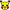

# 🎨Алгоритм создания лабиринта🎨


1. создаем HTML, CSS, JS документ


2. объявляем Canvas
	- в файле index.html

```html
<canvas id="Canvas"></canvas>
```


3. пишем стиль для Canvas в виде рамочки в файле Maze_CSS.css

```css
canvas{  
    border: 6px double black;  
    background: white;  
}
```


4. загружаем героя 

- в файле index.html

```html

```


- в файле Maze_CSS.css

```css
img{  
    display: none;  
}
```


5. определяем глобальные переменные для холста и контекста в файле Maze_JS.js

```JavaScript
var canvas;  
var context;
```


6. готовим холст
7. загружаем сам лабиринт - генерация лабиринта (https://mazegenerator.net/)
	- создаем функцию, которая будет рисовать наш лабиринт
	
	```JavaScript
	var x = 0;  
	var y = 0;  
	
	window.onload = function() {  
	    canvas = document.getElementById("Canvas");  
	    context = canvas.getContext("2d");  
	    drawMaze("maze1.jpg", 265, 5)  
		  
	};  
	  
	function drawMaze(mazeFile, startingX, startingY) {  
	
	}
	```
		
	- загружаем изображение лабиринта и изменяем размер холста в соответствии с размером изображения лабиринта
	
	```JavaScript
    dx = 0;  
    dy = 0;  
	  
    var imgMaze = new Image();  
    imgMaze.onload = function() {  
        canvas.width = imgMaze.width;  
        canvas.height = imgMaze.height;  
		  
        context.drawImage(imgMaze, 0, 0);  
		  
        x = startingX;  
        y = startingY;  
	
    };  
    
	```
	
	- рисуем лабиринт и значок
	
	```JavaScript
	var imgFace = document.getElementById("face");  
	        context.drawImage(imgFace, x, y);  
	        context.stroke();  
	imgMaze.src = mazeFile;  
	```
	
	- рисуем следующий кадр через 10 миллисекунд
	
	```JavaScript
	var timer; 
	clearTimeout(timer);  
	timer = setTimeout("drawMaze()", 10);  
	```


8. делаем анимацию значка
	- задаем начальную скорость перемещения значка
	- если значок при запуске находится в движении, останавливаем его
	- если нажата стрелка вверх, начинаем двигаться вверх
9. отображаем изменения на холсте
	- обновляем кадр только если значок движется
	- закрашиваем перемещение значка желтым цветом
	- обновляем координаты значка, создавая перемещение
	- проверка столкновения со стенками лабиринта
		- создаем отдельную функцию
		- перебираем все пикселы и "узнаем" их цвет
		- получаем данные для одного пиксела
		- смотрим на наличие черного цвета стены, что указывает на столкновение
